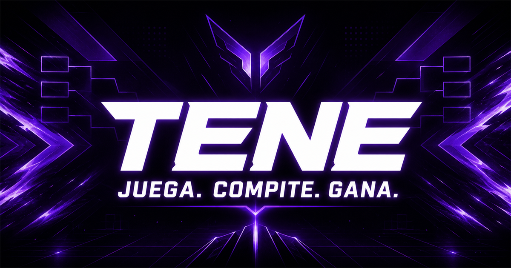
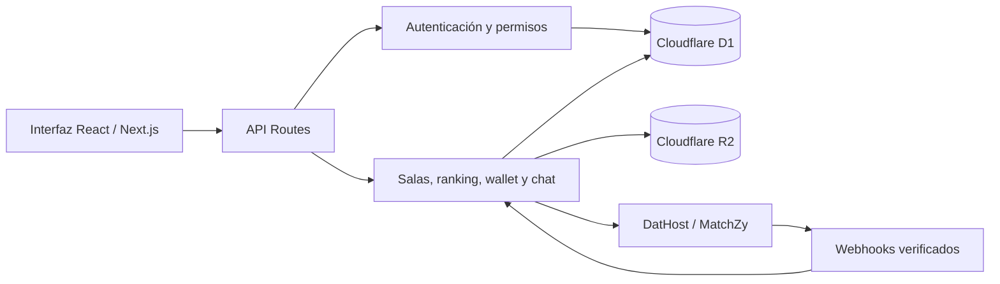

# TENE



Plataforma web para organizar partidas privadas 5v5 de Counter-Strike 2 en la comunidad peruana. TENE reúne salas, jugadores, clasificación, chat, control de saldo y operaciones administrativas en una experiencia competitiva unificada.

[](https://github.com/tomlaura-bit/tene/actions/workflows/quality.yml)

## Producto

TENE busca reducir la fricción de organizar partidas competitivas: cada sala muestra sus 10 plazas y participantes, permite unirse, forma equipos y mantiene el estado de la partida. La plataforma también incorpora perfiles vinculables con Steam, clasificación, wallet, beneficios, notificaciones accionables y herramientas de moderación.

### Funcionalidades destacadas

- Salas 5v5 con 10 slots visibles y control de capacidad concurrente.
- Flujo competitivo con draft, veto de mapas, estado de partida y resultados.
- Clasificación de jugadores, Elo, niveles y balance de equipos.
- Chat asociado a la experiencia de salas, con reportes y moderación.
- Wallet con saldo disponible, bloqueado, movimientos, recargas y retiros.
- Perfiles de usuario, vinculación con Steam y revisión de elegibilidad.
- Beneficios de suscripción y recompensas.
- Notificaciones con navegación contextual cuando requieren una acción.
- Solicitudes financieras idempotentes, conciliación y auditoría operativa.
- Exportación de datos personales y solicitudes de privacidad trazables.
- Paneles administrativos para usuarios, pagos, verificaciones, disputas y resultados.
- Integraciones preparadas para servidores CS2 mediante DatHost o MatchZy.

## Arquitectura



La capa de datos utiliza SQLite en Cloudflare D1 y Drizzle ORM. Los comprobantes y evidencias pueden almacenarse en R2. Las rutas de servidor concentran validación, autorización, límites de frecuencia y reglas de negocio; la interfaz consume esas rutas sin acceder directamente a la base de datos.

## Tecnologías

- Next.js 16, React 19 y TypeScript.
- Vinext, Vite y Cloudflare Workers.
- Cloudflare D1, R2 y Drizzle ORM.
- Tailwind CSS 4.
- Vitest y Testing Library.
- Playwright para pruebas E2E en Chromium.
- ESLint y GitHub Actions para control de calidad continuo.

## Calidad y pruebas

El proyecto cubre cinco niveles de validación siguiendo la estructura Arrange–Act–Assert cuando corresponde:

| Nivel | Alcance |
| --- | --- |
| Unitarias | Autenticación y reglas de salas |
| Componentes | Renderizado y comportamiento de los slots |
| Integración | Reserva de plazas contra una base SQLite real |
| Concurrencia | Capacidad máxima y prevención de reservas duplicadas |
| E2E | Navegación y recorridos principales en Chromium |

Cada `push` y pull request ejecuta automáticamente lint, pruebas, auditoría de dependencias, compilación y recorridos E2E mediante [GitHub Actions](https://github.com/tomlaura-bit/tene/actions).

La guía de operación, mantenimiento, incidentes y recuperación se encuentra en [docs/OPERATIONS.md](docs/OPERATIONS.md). Las reglas de seguridad y privacidad están en [SECURITY.md](SECURITY.md).

## Ejecución local

### Requisitos

- Node.js 22.13 o superior.
- npm.

### Instalación

```bash
git clone https://github.com/tomlaura-bit/tene.git
cd tene
npm ci
copy .env.example .env.local
npm run dev
```

La aplicación estará disponible en `http://localhost:3000`. En macOS o Linux, reemplaza `copy` por `cp`.

Las credenciales de Steam y del proveedor de servidores son necesarias únicamente para probar sus integraciones reales. No se deben subir secretos al repositorio.

## Comandos útiles

```bash
npm run dev              # desarrollo local
npm run build            # compilación de producción
npm run lint             # análisis estático
npm test                 # suite automatizada completa de Vitest
npm run test:unit        # pruebas unitarias y de componentes
npm run test:integration # integración y concurrencia
npm run test:db          # aplica y verifica todas las migraciones en SQLite
npm run test:docker      # repite las pruebas de base de datos en Linux aislado
npm run test:e2e         # recorridos E2E con Playwright
npm run test:coverage    # reporte de cobertura
npm run db:generate      # generar migraciones de Drizzle
```

## Estructura principal

```text
app/          interfaz, componentes y rutas API
db/           esquema y conexión de datos
drizzle/      migraciones de la base de datos
lib/          autenticación, seguridad e integraciones
tests/        pruebas unitarias, componentes, integración, concurrencia y E2E
.github/      automatización de calidad
.openai/      configuración de hosting y recursos administrados
```

## Estado del proyecto

TENE se encuentra en desarrollo activo. Antes de operar con pagos o partidas reales deben configurarse credenciales de producción, observabilidad, copias de seguridad, reglas operativas y revisión legal correspondientes.

## Autor

Desarrollado por [Tom Laura](https://github.com/tomlaura-bit) como proyecto de producto web, arquitectura full stack, automatización de pruebas e integración para esports.
